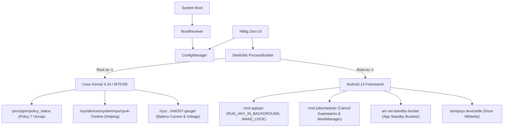

# HiBig Zero ⚡📖

> **Zero-Drain Power & Hardware Manager for Bigme HiBreak (MediaTek Helio P35 / MT6765)**  
> **Author:** [right9code](https://github.com/right9code)  
> **License:** [PolyForm Noncommercial 1.0.0](LICENSE) *(Personal & Non-Commercial Use Only)*

---

## 📌 Overview

**HiBig Zero** is a dedicated, root-level power management and hardware tuning suite built specifically for the **Bigme HiBreak B6** (Black & White and Color E-ink smartphones running Android 14).

Stock Bigme firmware suffers from severe active and standby battery drain caused by runaway vendor daemons, broken MediaTek power management policies, and unrestricted background services. **HiBig Zero** systematically neutralizes every measured drain source, dropping active reading drain by up to **500 mW** and eliminating tens of thousands of background wakeups per day.

---

## 🔋 Measured Impact & Benchmarks

| Optimization Area | Stock Firmware Behavior | HiBig Zero Optimized | Real-World Impact |
|---|---|---|---|
| **PPM CPU Frequency Lock** | Screen-ON locked Cluster 0 to **2.068 GHz** max clock | Uncaps policy 7; drops idle clocks to **745–900 MHz** | **300–500 mW** active savings |
| **CPU Core Hotplugging** | All 8 cores active even when reading static pages | 4 Big cores dynamically offlined (`cpu4-7`) | **150–250 mW** leakage reduction |
| **`uart2serport` Crash Loop** | Missing script spawns error loop every 2.5s (~34,500/day) | Injects clean stub; init crash-latch eliminated | CPU load drops from >25 to <2 |
| **Gboard Telemetry & ML** | 10+ background Superpacks/WorkManager jobs in Doze | Cancels jobs; restricts AppOps to foreground only | Zero deep-sleep interruptions |
| **App Standby Buckets** | All 200+ apps hardcoded to `EXEMPTED (5)` | Granular bucket control (`ACTIVE` to `RARE/RESTRICTED`) | Eliminates Doze bypasses |
| **Inactivity Retention** | Screen suspend blocker drained battery while idle | Auto-shutdown daemon powers off device to **0.00 mA** | Unlimited static image retention |

---

## ✨ Key Features

### 1. ⚡ CPU Governor & MediaTek PPM Frequency Uncap
* **The Culprit:** MediaTek's `mtkpower` HAL hard-locks `PPM_POLICY_USER_LIMIT` (Policy 7) whenever the display turns on, pinning Cluster 0 to 2.068 GHz and Cluster 1 to 1.515 GHz.
* **The Solution:** Disables Policy 7 via `/proc/ppm/policy_status` and applies tuned `schedutil_efficient` governor scaling down to 900 MHz (Cluster 0) and 400–745 MHz (Cluster 1).

### 2. 📖 Dynamic 4-Core E-Reader Mode
* Offlines cores 4–7 (`/sys/devices/system/cpu/cpu[4-7]/online = 0`) on demand.
* Provides a buttery-smooth reading experience in KOReader or Obsidian using 4 Little cores while entirely eliminating idle leakage across the Big cluster.

### 3. 🛡️ Systemless `uart2serport` Fix
* Bigme's `PowerStandbyManager` invokes `ctl.start uart2serport` on every screen wake. Because `/system/bin/start_uart2serport.sh` was omitted from the EEA firmware, init crashed repeatedly.
* Clears `sys.init.updatable_crashing` and permanently quiets `flags_health_check`.

### 4. 📦 Granular Package Freezer & Standby Bucket Manager (Tab 2)
* Live queried package inspector with an E-ink friendly **`OPTIONS ▾`** dropdown menu per app.
* **Freeze / Unfreeze:** Disables bloatware via `pm disable-user --user 0`.
* **AppOps Restrict:** Blocks background wakelocks, alarm wakeups, and background execution.
* **Standby Bucket Selector:** Seamlessly assigns apps to `ACTIVE (10)`, `WORKING_SET (20)`, `FREQUENT (30)`, `RARE (40)`, or `RESTRICTED (45)`.
* **Doze Exemption Toggle:** Live control over Android Doze whitelist (`dumpsys deviceidle whitelist`).

### 5. ⌨️ Gboard Lockdown 2.0
* Purges the Android 14 `JobScheduler` queue of all Google Superpacks dictionary and telemetry sync jobs.
* Enforces `RUN_ANY_IN_BACKGROUND ignore` and `START_FOREGROUND ignore` without affecting normal foreground typing or offline autocorrect.

### 6. ⏱️ Inactivity Auto-Shutdown Daemon
* Bundled background daemon running in `/data/local/tmp/auto_shutdown.sh`.
* Accurately tracks screen state using Android 14 `mWakefulness=Awake` (preventing false shutdowns while reading static pages).
* Configurable timeout presets (`60m`, `120m`, `240m`, `480m`) or custom manual inputs. Shuts down cleanly (`reboot -p`) to retain the current E-ink image at **0.00 mA** power draw.

### 7. 📊 Live Power & Hardware Monitor (Tab 3)
* Real-time 3-second hardware polling:
  * **Battery Current:** Discharge/charge current in mA.
  * **Battery Voltage & Temperature:** Accurate readings from `mt6357-gauge`.
  * **CPU Frequencies:** Cluster 0 & Cluster 1 clock speeds and governors.
  * **Online Core Detection:** Real-time indicator for 8-Core vs 4-Core E-Reader mode.
  * **MediaTek PPM State:** Live check of Policy 7 (`[UNCAPPED]` vs `[LOCKED]`).

---

## 🛠️ System Architecture



---

## 📥 Installation

### Requirements
* **Device:** Bigme HiBreak B6 (B&W or Color)
* **OS:** Android 14 (EEA / Global)
* **Root:** Magisk v26+ installed with root permissions granted

### Steps
1. Download the latest APK from the [Releases](releases/) folder:
   ```sh
   HiBigZero-v1.0.0-release.apk
   ```
2. Install via ADB:
   ```sh
   adb install -r HiBigZero-v1.0.0-release.apk
   ```
3. Open **HiBig Zero** on your device and grant Root (Superuser) permissions when prompted by Magisk.
4. Tweak your desired toggles or switch to **E-Reader Mode** on Tab 1.

---

## 🔨 Building from Source

The repository includes a zero-dependency build script that compiles Java 8 source directly into Dalvik bytecode using Android SDK build-tools:

### Prerequisites
* Java Development Kit (JDK 8 or JDK 17)
* Android SDK `platforms;android-35`
* Android SDK `build-tools;35.0.0` (`aapt`, `d8`, `zipalign`, `apksigner`)

### Build Command
```sh
python3 build.py
```
The compiled, aligned, and signed APK will be generated under `releases/HiBigZero-v1.0.0-release.apk` along with its SHA-256 checksum file.

---

## 📄 License & Attribution

Copyright (c) 2026 **right9code**. All rights reserved.

This project is licensed under the **PolyForm Noncommercial License 1.0.0** ([LICENSE](LICENSE)).
* **Personal & Educational Use:** Allowed and encouraged.
* **Commercial Use:** Strictly prohibited. You may not sell, monetize, incorporate into paid products, or distribute commercial forks of this software without explicit written permission from the author.

---
*Developed with ❤️ for the E-ink community by [right9code](https://github.com/right9code).*
