# HiBig Zero ⚡📖

> **Zero-Drain Power & Hardware Manager for Bigme HiBreak (MediaTek Helio P35 / MT6765)**  
> **Author:** [right9code](https://github.com/right9code)  
> **License:** [PolyForm Noncommercial 1.0.0](LICENSE) *(Personal & Non-Commercial Use Only)*

---

## 📌 Overview

**HiBig Zero** is a dedicated, root-level power management and hardware tuning suite built specifically for the **Bigme HiBreak B6** (Black & White and Color E-ink smartphones running Android 14).

Stock Bigme firmware suffers from severe active and standby battery drain caused by runaway vendor daemons, broken MediaTek power management policies, and unrestricted background services. **HiBig Zero** systematically neutralizes every measured drain source, dropping active reading drain by up to **500 mW** and eliminating tens of thousands of background wakeups per day.

---

## 🎨 User Interface Highlights

HiBig Zero ships with an E-ink native, strictly 1-bit monochrome interface:

* **Responsive typography** — every label uses Android sp text sizing and the system typeface, so text follows the device font scale instead of a hardcoded width-based scaler.
* **Density-independent layout** — all padding, margins, and dividers use dp, so the UI scales correctly across screen densities.
* **Compact responsive banner** — a two-line status strip showing the app name, version (`v1.3.0`), and author (`by right9code`).
* **UPDATE button** — one-tap GitHub release checker with in-app download, progress, and self-install.
* **Clean tab bar** — tabs are visually separated from the banner and from each other, use fixed labels, and mark the active tab with an underline indicator instead of a `>>` prefix.
* **Collapsible sections** — every section header (`HARDWARE`, `DEBLOAT`, `NETWORK`, `POWER`, `PACKAGE MANAGER`, and the Battery sections) can be tapped to collapse or expand its body.
* **Package Manager clarity** — the second tab is now `PACKAGE MANAGER` with a `FREEZE, UNFREEZE, OR RESTRICT` description. Each app row shows the name, package, and a plain-language status line (`Not frozen | background: allowed | doze optimized | usage: ...`) with `FREEZE`/`UNFREEZE` and `OPTIONS` stacked on the right.
* **Filter and sort dropdowns** — the six cryptic filter chips (`RSTR`, `PROT`) were replaced by a single `FILTER:` selector with readable options, alongside the existing `SORT:` selector.
* **Removed non-essential controls** — `PAGE UP`/`PAGE DOWN` and the bulk `FREEZE ALL`/`UNFREEZE ALL`/`RESTRICT USR` shortcuts were removed; per-app actions remain in each row.
* **Strict 1-bit monochrome styling** — all buttons, the search field, and the tab bar use explicit black/white bordered drawables, eliminating the system grey Material backgrounds.
* **E-ink friendly glyphs** — emoji and pictographs in menus and buttons were replaced with ASCII-safe labels for predictable rendering.

---

## 📦 App Installer (APPS Tab)

HiBig Zero includes a built-in **App Installer** that downloads, installs, and manages essential apps directly from GitHub releases — no Play Store or browser needed.

### Managed Apps

| App | Source | Install Type |
|-----|--------|-------------|
| **AnyHome** | [right9code/AnyHome](https://github.com/right9code/AnyHome) | Magisk system app |
| **KOReader** | [koreader/koreader](https://github.com/koreader/koreader) | User app |
| **E-Ink Bro** | [plateaukao/einkbro](https://github.com/plateaukao/einkbro) | User app |
| **Obsidian** | [obsidianmd/obsidian-releases](https://github.com/obsidianmd/obsidian-releases) | User app |
| **MiXplorer** | [driftywinds/mixplorer-releases](https://github.com/driftywinds/mixplorer-releases) | User app |
| **LocalSend** | [localsend/localsend](https://github.com/localsend/localsend) | User app |

### Features
* **Resume & retry** — downloads resume from where they left off if the connection drops, with 3 retries and exponential backoff.
* **APK verification** — file size is checked against the GitHub API before installing.
* **SELinux-safe installs** — APKs are staged to `/data/local/tmp/` with `chmod 644` before `pm install -r -d -g`.
* **MANAGE_EXTERNAL_STORAGE** — automatically granted to KOReader, MiXplorer, and Obsidian on Android 14.
* **Magisk system app support** — AnyHome is installed as a systemless Magisk module to `/system/priv-app/`.
* **Version comparison** — skips download if already on the latest version, handles `-rc1`/`-beta` suffixes.

---

## 🔄 Self-Updater

Tap the **UPDATE** button in the header to check for new releases of HiBig Zero itself:

* Fetches the latest release from `right9code/hibigzero` via GitHub API
* Compares installed version with the latest tag
* Shows release notes and a one-tap **UPDATE NOW** or **REINSTALL** button
* Downloads with progress percentage, installs via root `pm install`
* Handles HTTP redirects, resume on failure, and APK verification

---

## 🔋 Measured Impact & Benchmarks

| Optimization Area | Stock Firmware Behavior | HiBig Zero Optimized | Real-World Impact |
|---|---|---|---|
| **PPM CPU Frequency Lock** | Screen-ON locked Cluster 0 to **2.068 GHz** max clock | Uncaps policy 7; drops idle clocks to **745–900 MHz** | **300–500 mW** active savings |
| **CPU Core Hotplugging** | All 8 cores active even when reading static pages | 4 Big cores dynamically offlined (`cpu4-7`) | **150–250 mW** leakage reduction |
| **`uart2serport` Crash Loop** | Missing script spawns error loop every 2.5s (~34,500/day) | Injects clean stub; init crash-latch eliminated | CPU load drops from >25 to <2 |
| **Gboard Telemetry & ML** | 10+ background Superpacks/WorkManager jobs in Doze | Cancels jobs; restricts AppOps to foreground only | Zero deep-sleep interruptions |
| **App Standby Buckets** | All 200+ apps hardcoded to `EXEMPTED (5)` | Granular bucket control (`ACTIVE` to `RARE/RESTRICTED`) | Eliminates Doze bypasses |
| **Inactivity Retention** | Screen suspend blocker drained battery while idle | Auto-shutdown daemon powers off device to **0.00 mA** | Unlimited static image retention |

---

## ✨ Key Features

### 1. ⚡ CPU Governor & MediaTek PPM Frequency Uncap
* **The Culprit:** MediaTek's `mtkpower` HAL hard-locks `PPM_POLICY_USER_LIMIT` (Policy 7) whenever the display turns on, pinning Cluster 0 to 2.068 GHz and Cluster 1 to 1.515 GHz.
* **The Solution:** Disables Policy 7 via `/proc/ppm/policy_status` and applies tuned `schedutil_efficient` governor scaling down to 900 MHz (Cluster 0) and 400–745 MHz (Cluster 1).

### 2. 📖 Dynamic 4-Core E-Reader Mode
* Offlines cores 4–7 (`/sys/devices/system/cpu/cpu[4-7]/online = 0`) on demand.
* Provides a buttery-smooth reading experience in KOReader or Obsidian using 4 Little cores while entirely eliminating idle leakage across the Big cluster.

### 3. 🛡️ Systemless `uart2serport` Fix
* Bigme's `PowerStandbyManager` invokes `ctl.start uart2serport` on every screen wake. Because `/system/bin/start_uart2serport.sh` was omitted from the EEA firmware, init crashed repeatedly.
* Clears `sys.init.updatable_crashing` and permanently quiets `flags_health_check`.

### 4. 📦 Granular Package Freezer & Standby Bucket Manager (Tab 2)
* Live queried package inspector with an E-ink friendly **`OPTIONS ▾`** dropdown menu per app.
* **Freeze / Unfreeze:** Disables bloatware via `pm disable-user --user 0`.
* **AppOps Restrict:** Blocks background wakelocks, alarm wakeups, and background execution.
* **Standby Bucket Selector:** Seamlessly assigns apps to `ACTIVE (10)`, `WORKING_SET (20)`, `FREQUENT (30)`, `RARE (40)`, or `RESTRICTED (45)`.
* **Doze Exemption Toggle:** Live control over Android Doze whitelist (`dumpsys deviceidle whitelist`).

### 5. ⌨️ Gboard Lockdown 2.0
* Purges the Android 14 `JobScheduler` queue of all Google Superpacks dictionary and telemetry sync jobs.
* Enforces `RUN_ANY_IN_BACKGROUND ignore` and `START_FOREGROUND ignore` without affecting normal foreground typing or offline autocorrect.

### 6. ⏱️ Inactivity Auto-Shutdown (AlarmManager, no daemon)
* A single `AlarmManager` alarm (`setExactAndAllowWhileIdle`) is armed on screen-off and cancelled on screen-on. No shell daemon, no polling, no wakeups — the timeout costs **0 mA** until it fires, then powers off with `reboot -p` to retain the current E-ink image.
* Configurable timeout presets (`60m`, `120m`, `240m`, `480m`) or a custom value.
* **Charging guard:** a plugged-in device is rescheduled instead of powered off (nothing is saved by powering off a charger). Toggle `SKIP_WHILE_CHARGING`.
* **Safety net:** when the alarm fires the receiver re-checks `PowerManager.isInteractive()` and a monotonic screen-off stamp, so a killed process or a stale alarm can never power the device off mid-use. Any error reschedules — it never fails open into a shutdown.
* **Single authority:** enabling this also disables Bigme’s own `PowersaveShutDownAlarmReceiver` (re-asserted every boot), so two power-off timers can never compete. `SHUTDOWN_TEST_MODE` logs the decision instead of performing it.

### 7. 📊 Live Power & Hardware Monitor (Tab 3)
* Real-time 3-second hardware polling:
  * **Battery Current:** Discharge/charge current in mA.
  * **Battery Voltage & Temperature:** Accurate readings from `mt6357-gauge`.
  * **CPU Frequencies:** Cluster 0 & Cluster 1 clock speeds and governors.
  * **Online Core Detection:** Real-time indicator for 8-Core vs 4-Core E-Reader mode.
  * **MediaTek PPM State:** Live check of Policy 7 (`[UNCAPPED]` vs `[LOCKED]`).

---

## 🛠️ System Architecture

```mermaid
graph TD
    App[HiBig Zero UI] --> Config[ConfigManager]
    App --> Shell[ShellUtils ProcessBuilder]
    App --> Installer[AppInstaller Engine]
    App --> Updater[Self-Updater Engine]
    
    Shell -->|Root su -c| Kernel[Linux Kernel 4.19 / MT6765]
    Shell -->|Root su -c| AndroidOS[Android 14 Framework]
    
    Installer -->|GitHub API| GitHub[GitHub Releases]
    Updater -->|GitHub API| GitHub
    
    Kernel --> PPM["/proc/ppm/policy_status (Policy 7 Uncap)"]
    Kernel --> Hotplug["/sys/devices/system/cpu/cpu4-7/online (Hotplug)"]
    Kernel --> PMIC["/sys/.../mt6357-gauge/ (Battery Current & Voltage)"]
    
    AndroidOS --> AppOps["cmd appops (RUN_ANY_IN_BACKGROUND, WAKE_LOCK)"]
    AndroidOS --> Jobs["cmd jobscheduler (Cancel Superpacks & WorkManager)"]
    AndroidOS --> Standby["am set-standby-bucket (App Standby Buckets)"]
    AndroidOS --> Doze["dumpsys deviceidle (Doze Whitelist)"]
    
    Boot[System Boot] --> BootRec[BootReceiver]
    BootRec --> Config
```



## 🔓 Device Rooting Guide

> [!IMPORTANT]
> **Root Access is Mandatory**  
> HiBig Zero requires Superuser (Root) permissions via Magisk to communicate directly with MediaTek kernel sysfs nodes, uncap PPM frequency locks, dynamic hotplug CPU cores, and enforce boot rules.

If your Bigme HiBreak is not yet rooted, follow the comprehensive step-by-step guide included in this repository:

📖 **[Bigme B6 & HiBreak — Complete Rooting & Unbricking Guide](docs/ROOTING_GUIDE.md)**

### Highlights from the Guide:
* **Overcoming Single-Button Quirk:** Uses [`right9code/mtkclient`](https://github.com/right9code/mtkclient) with hardware watchdog auto-reboot (`--reboot`) to bypass the physical button limitation.
* **Full Partition Backup:** How to safely dump all 48 partitions before flashing.
* **Magisk Patching:** Extracting `boot_a.bin`, patching via Magisk Manager, and flashing back safely.
* **One-Command Unbricking:** Instant recovery to stock firmware if anything goes wrong.

---

## 📥 Installation

### Requirements
* **Device:** Bigme HiBreak B6 (B&W or Color)
* **OS:** Android 14 (EEA / Global)
* **Root:** Magisk v26+ installed (see [Rooting Guide](docs/ROOTING_GUIDE.md))

### Steps
1. Download the latest APK from [Releases](https://github.com/right9code/hibigzero/releases/latest):
   ```sh
   HiBigZero-v1.3.0-release.apk
   ```
2. Install via ADB:
   ```sh
   adb install -r HiBigZero-v1.3.0-release.apk
   ```
3. Open **HiBig Zero** on your device and grant Root (Superuser) permissions when prompted by Magisk.
4. Tweak your desired toggles or switch to **E-Reader Mode** on Tab 1.
5. Use the **UPDATE** button in the header to check for future updates.

---

## 🔨 Building from Source

The repository includes a zero-dependency build script that compiles Java 8 source directly into Dalvik bytecode using Android SDK build-tools:

### Prerequisites
* Java Development Kit (JDK 8 or JDK 17)
* Android SDK `platforms;android-35`
* Android SDK `build-tools;35.0.0` (`aapt`, `d8`, `zipalign`, `apksigner`)

### Build Command
```sh
python3 build.py
```
The compiled, aligned, and signed APK is generated under `releases/` together with its SHA-256 checksum file.

### Signing key (read this before releasing)
The build is signed with a key kept **outside this repository** (the repo is public, so a signing key must never be committed):

```
~/.config/hibigzero/hibigzero-release.jks      # the key itself (chmod 600)
~/.config/hibigzero/keystore.properties        # storeFile / storePassword / keyAlias / keyPassword
```

Override with `HIBIGZERO_KEYSTORE`, `HIBIGZERO_KEYSTORE_PROPS`, `HIBIGZERO_STOREPASS` if you keep them elsewhere.

**All releases must be signed with the same certificate.** Android refuses to update an app whose signature changed (`INSTALL_FAILED_UPDATE_INCOMPATIBLE`), so a new key orphans every existing installation - users can only recover by uninstalling and reinstalling.

`build.py` therefore:
* **refuses to build** if the keystore is missing (it will never silently mint a new identity),
* prints and verifies the certificate fingerprint on every build,
* prints a loud warning if the identity differs from the expected `c378f6f7...`.

To deliberately start a brand new identity: `python3 build.py --init-key` (then tell your users they must reinstall once).

> **History:** builds up to v1.3.3 were signed with a key stored in `/tmp`, which was lost when `/tmp` was cleared (cert `2238ad46...`). v1.3.4 onward uses the persistent key above. Installations of v1.3.3 or older must be uninstalled once before they can be updated.

---

## 📄 License & Attribution

Copyright (c) 2026 **right9code**. All rights reserved.

This project is licensed under the **PolyForm Noncommercial License 1.0.0** ([LICENSE](LICENSE)).
* **Personal & Educational Use:** Allowed and encouraged.
* **Commercial Use:** Strictly prohibited. You may not sell, monetize, incorporate into paid products, or distribute commercial forks of this software without explicit written permission from the author.

---
*Developed with ❤️ for the E-ink community by [right9code](https://github.com/right9code).*
